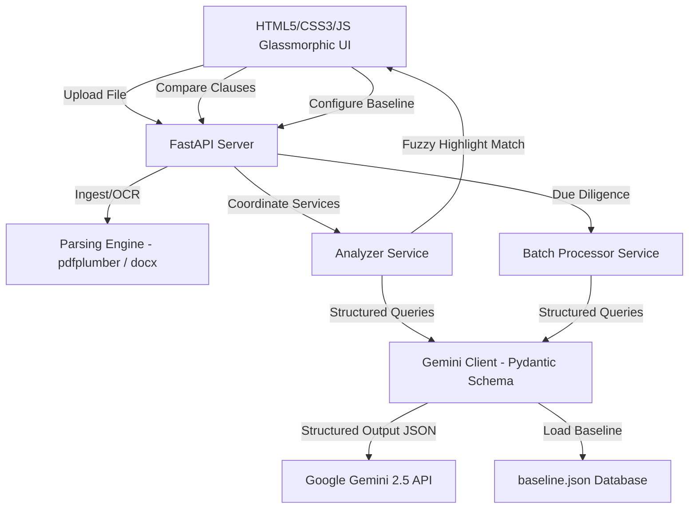

# Legal Document Intelligence System (Contract Compliance & Due-Diligence)

A production-grade, containerized legal tech compliance platform. It acts as a "first pass" legal reviewer, surfacing the **10% of a contract that requires human intervention** and automating the rest. 

The system handles document ingestion (DOCX/PDF, including scanned PDFs via multimodal OCR), extracts target clauses, compares them semantically to a configurable market-standard baseline, runs a multi-dimensional risk matrix, and generates a plain-English 1-page executive summary. It also features a side-by-side Batch Due-Diligence comparison matrix for multiple contracts.

---

## 🏗️ Architecture & Component Design
The system is built with a highly decoupled, modular architecture:



### File Hierarchy
- `/app.py`: FastAPI server entrypoint (defines REST API endpoints & serves static assets).
- `/core`:
  - `config.py`: Environment configurations and baseline loading/saving persistence.
  - `parser.py`: Text parser for DOCX and PDF (handles paragraph boundaries, numbering, and OCR flags).
  - `gemini_client.py`: Google Gemini API client wrapping. Restricts output schemas via Pydantic.
- `/services`:
  - `analyzer.py`: Orchestrates parsing, risk calculations, and text position mapping.
  - `batch_processor.py`: Orchestrates multi-contract side-by-side evaluations.
- `/static`: Vanilla HTML, CSS, JS frontend assets designed with glassmorphism.
- `/data`: Persistent market baseline configurations.
- `/sample_contracts`: Pre-seeded DOCX agreements for out-of-the-box evaluations.

---

## ⚡ Quick Start & Deployment

### Option A: Running with Docker (Recommended)
Docker ensures all layout parsers and system dependencies build identically.

#### Using Docker Compose (if installed):
1. **Spin up the stack**:
   ```bash
   docker compose up --build -d
   ```
   *(Or `docker-compose up --build -d` on older installations).*

#### Using direct Docker commands (Alternative):
1. **Build the image**:
   ```bash
   docker build -t legal-ai-app .
   ```
2. **Run the container**:
   ```bash
   docker run -d --name legal_ai_app -p 8000:8000 --env-file .env legal-ai-app
   ```

3. **Access the application**:
   Open your browser to [http://localhost:8000](http://localhost:8000).

---

### Option B: Local Running (Python Virtual Environment)
1. **Set up a virtual environment**:
   ```bash
   python3 -m venv venv
   source venv/bin/activate
   ```

2. **Install dependencies**:
   ```bash
   pip install -r requirements.txt
   ```

3. **Set your environment variable**:
   ```bash
   export GEMINI_API_KEY="your-actual-gemini-api-key"
   ```

4. **Launch the Uvicorn web server**:
   ```bash
   uvicorn app:app --reload --host 0.0.0.0 --port 8000
   ```

5. **Open browser**:
   Navigate to [http://localhost:8000](http://localhost:8000).

---

## 🧪 Testing and Academic Mark Evaluation Guide
To make it easy to verify the success metrics, three pre-seeded test contracts are generated in the `/sample_contracts` directory:

1. `standard_partnership_agreement.docx`: A standard, balanced business contract.
2. `poison_pill_vendor_contract.docx`: Seeded with **severe high-risk, non-standard clauses**:
   - *Indemnity*: Unilateral client indemnity covering vendor gross negligence.
   - *Limitation of Liability*: Cap of **$10.00** on vendor liability; client liability is uncapped.
   - *Governing Law*: exclusive jurisdiction in **Pyongyang, North Korea**.
   - *Termination*: Unilateral termination by vendor on **24 hours' notice**; client has a 365-day cure period.
   - *IP Ownership*: Automatic transfer of client's pre-existing intellectual property to vendor.
   - *Payment Terms*: Payment within **24 hours**; **15% daily interest** compounding hourly.
3. `consulting_service_agreement.docx`: A standard consulting contract.

### Step-by-Step Test Procedure:
1. **API Activation**: Go to **Settings** in the dashboard and input your API Key.
2. **Standard Agreement Test**: Upload `standard_partnership_agreement.docx`.
   - *Verify*: The dashboard shows a Low/Medium overall risk score (under 30%).
   - *Verify*: Extracted clauses are mostly flagged as **Favourable** or **Standard**.
3. **Poison Pill Detection Test**: Upload `poison_pill_vendor_contract.docx`.
   - *Verify*: The system flags an **overall risk score of 90%+**.
   - *Verify*: Key clauses show **High Risk (Red)**, and are flagged as **Unfavourable** or **Unusual**.
   - *Verify*: The Executive Summary points out the uncapped risk allocation and lists the North Korean jurisdiction, 24-hour payment, and IP transfers as the top 3 issues for negotiation.
4. **Interactive Highlighting**: Click on the **Governing Law** card under the extracted clauses list in the right pane.
   - *Verify*: The left pane automatically scrolls to Section 3 and highlights the North Korean jurisdiction clause.
5. **Due-Diligence Comparison Test**: Go to the **Due Diligence Workspace** tab.
   - Select all three uploaded contracts via the checkboxes.
   - Choose **Governing Law** as the target clause type.
   - Click **Compare Clauses**.
   - *Verify*: The comparative matrix places Delaware, North Korea, and California side-by-side, flags their risk rankings, and details the semantic differences.

---

## 🔒 Security & Data Privacy
- **API Keys**: Keys are transmitted over HTTPS to the backend, loaded securely in execution contexts, and are never written to disk.
- **Session Cache**: Uploaded contracts are cached in-memory and can be deleted instantly by clicking the trash icon in the registry panel or clearing the browser storage.
